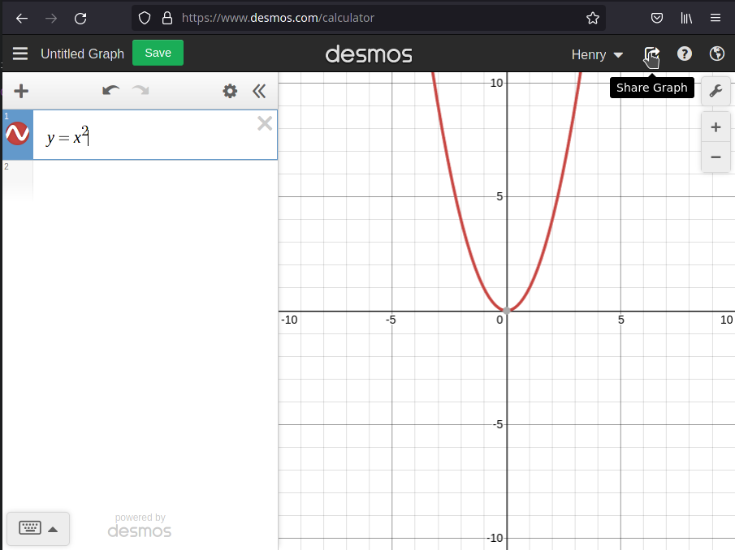
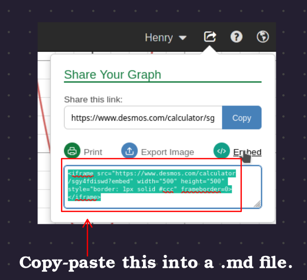

# Working With mdbook's Markdown
<<<<<<< HEAD
=======

## MathJax

`mdbook` uses MathJax to render \\(\LaTeX\\)-like math. It isn't as powerful as full \\(\LaTeX\\).

This section is unfinished. For now, please reference [`src/week_1/cs_inequality_derivation.md`](https://github.com/MAT334A/lecture-notes/blob/main/src/week_1/cs_inequality_derivation.md?plain=1).

## Embedding Graphs

We can embed graphs from [`Desmos`](https://www.desmos.com/calculator) via its `embed` feature.

To do this,
 * Click the `share` icon in `Desmos`


 * Click "embed" and copy the `<iframe ... />`. This `<iframe />` can be pasted directly into a (`mdbook`) markdown file.


By default, Desmos graphs don't have a hide/show (or a play/pause button for interactive graphs). As such, I like to put graphs in a dropdown by surrounding their `iframe` with `<details>` and `</details>`. Let's see an example:
```html
<details>
<iframe src="https://www.desmos.com/calculator/sgy4fdiswd?embed" width="500" height="500" style="border: 1px solid #ccc" frameborder=0></iframe>
</details>
```

gives us

<details>
<iframe src="https://www.desmos.com/calculator/sgy4fdiswd?embed" width="500" height="500" style="border: 1px solid #ccc" frameborder=0></iframe>
</details>

Let's give the dropdown a descriptive title (which, unfortunately, is difficult to include MathJax in):
```html
<details><summary>Show Graph</summary>
<iframe src="https://www.desmos.com/calculator/sgy4fdiswd?embed" width="500" height="500" style="border: 1px solid #ccc" frameborder=0></iframe>
</details>
```

...which gives us...
<details><summary>Show Graph</summary>
<iframe src="https://www.desmos.com/calculator/sgy4fdiswd?embed" width="500" height="500" style="border: 1px solid #ccc" frameborder=0></iframe>
</details>

**When embedding graphs, it is very useful to adjust the `window` (under `Graph Settings`)!**

>>>>>>> 0fd6f8abccf9f93cfe3510165ecc9d3580bba04d
