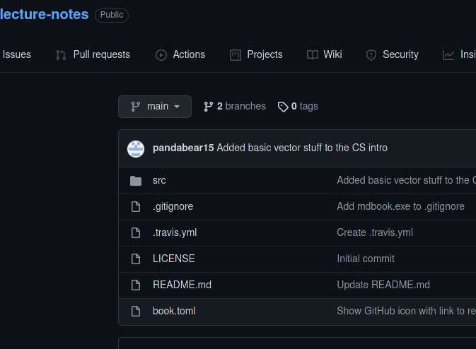
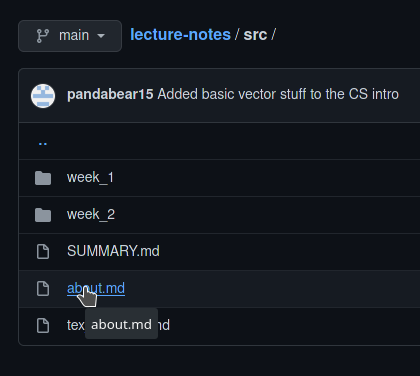
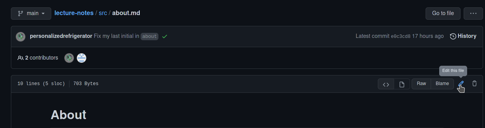
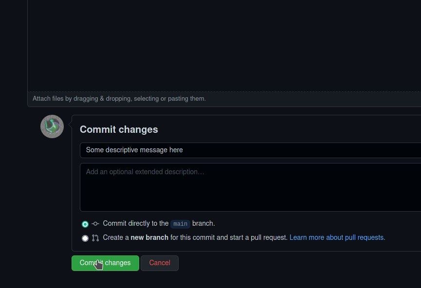

# Working on GitHub
<<<<<<< HEAD
=======

Making changes to the book directly through GitHub allows members of the `MAT334` GitHub organization to contribute to this work without installing `mdbook` or `git`.

Note, however, that it can take several minutes for the rendered book to update. Any change (breaking or non-breaking) will be visible to everyone. As such, this method should be reserved for new sections or small changes to existing sections.

 * Navigate to the file you want to edit (on GitHub).

 * Click `edit`

 * After making changes, type a descriptive message and click `commit`

 * If you would like to make your changes publicly available without applying them to the published copy of the book, select "create a pull request" prior to committing.

>>>>>>> 0fd6f8abccf9f93cfe3510165ecc9d3580bba04d
