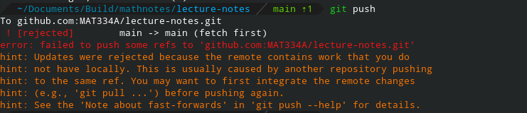

# Working Locally

Working with the markdown for this document locally requires some setup. Let's start by `cloning` the GitHub repository &mdash; creating a local copy on your device.

## Installing `git`

For `Linux`, `MacOS`, and `Windows`, follow [this tutorial to install Git](https://git-scm.com/book/en/v2/Getting-Started-Installing-Git). (Git may require additional configuration.](https://git-scm.com/book/en/v2/Getting-Started-First-Time-Git-Setup)

You may also want to [set up GitHub SSH authentication](https://docs.github.com/en/authentication/connecting-to-github-with-ssh/about-ssh) so that you don't have to supply your GitHub credentials when pushing (saving) your code to GitHub.

## Working with `git` and the commandline

On Windows, open `Git Bash`. On `MacOS` and `Linux`, open terminal window.

 * `cd`: Changes the working directory.
   * For example, `cd ./Documents` moves to a subfolder called `Documents`.
   * `cd ../` changes to the folder that contains the current directory (moves up one directory).
 * `pwd` stands for <u>p</u>rint <u>w</u>orking <u>d</u>irectory. As its name suggests, running `pwd` prints the path to the directory you're in.
 * `ls` lists files in the current directory.

Now, let's `clone` the GitHub repository:
 * Choose a directory to store the contents of the `mdbook` and `cd` to it.
 * Type `git clone https://github.com/MAT334A/lecture-notes.git`, then `ls`
 * You should see a new sub-folder named `lecture-notes`. `cd` to it.

You've cloned the repository! You can now open any of the markdown files in the editor of your choice (I suggest [VisualStudio Code](https://code.visualstudio.com/)).

Make a small change in one of the markdown files (and save it!). Try running `git status`. You should see something like the following:
```git
On branch main
Your branch is up to date with 'origin/main'.

Changes not staged for commit:
  (use "git add <file>..." to update what will be committed)
  (use "git restore <file>..." to discard changes in working directory)
        modified:   src/SUMMARY.md

Untracked files:
  (use "git add <file>..." to include in what will be committed)
        src/contributing/

no changes added to commit (use "git add" and/or "git commit -a")
```

Above, we can see that I have uncommitted changes in "src/contributing/". Let's add those changes to `git`:
```sh
bash$ git add ./src
bash$ git status
On branch main
Your branch is up to date with 'origin/main'.

Changes to be committed:
  (use "git restore --staged <file>..." to unstage)
        modified:   src/SUMMARY.md
        new file:   src/contributing/mdbook_markdown.md
        new file:   src/contributing/online_editing.md
        new file:   src/contributing/working_locally.md
bash$ 
```

Now, let's create the [`commit`](https://git-scm.com/docs/git-commit):

```sh
bash$ git commit --message="A concise description of the changes should go here"
bash$
```

Now that we've collected and labeled our changes, we can `push` them to `GitHub`:
```sh
bash$ git push
```

If `git` complains that it is unable to `push`, it's likely that someone else has made changes to the repository that you don't have! You need to `pull` their changes:
```sh
bash$ git pull
```

`git pull` should give instructions for resolving conflicts (if there are any). After resolving conflicts, try pushing again.

```sh
bash$ git push
```

Don't run `git push --force`. `git push --force` can overwrite changes made to the book by others.

## Downloading `mdbook`

If you are familiar with the Rust programming language, [follow this tutorial to install `mdbook`](https://rust-lang.github.io/mdBook/cli/index.html).

If not, [download `mdbook`](https://github.com/rust-lang/mdBook/releases) from its GitHub releases page.
 * Select the file for your operating system.
 * Extract it.
 * Copy the executable file to the folder that has `README.md`, `src/`, etc. (let's call this the root directory of the repository).
 * Make sure the executable's name is in the `.gitignore` file (to see it, type `ls -a` in the commandline &mdash; it's a hidden file).
 * You should now be able to run `./mdbook` from the root directory of the repository (or `./mdbook.exe` if you're on windows).
 * `./mdbook serve` will start a local server (its output will tell you its URL). Opening it in your browser lets you preview the book.
   * Changing a file should cause the served copy of the book to update.

----

## Git Troubleshooting

### Push Failure

Pushing can fail if the server has changes you don't.



If this happens, you can `merge` the remote changes or `rebase` your commits on top of them. Rebasing can help keep the `git` history simple, so let's use it.

```bash
bash$ git fetch
bash$ git rebase
```

`git fetch` gets the changes from the server, **but doesn't apply them**. `git rebase` then applies your changes to the server's. [For more information about rebasing, see this document.](https://git-scm.com/book/en/v2/Git-Branching-Rebasing)

