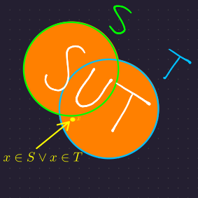
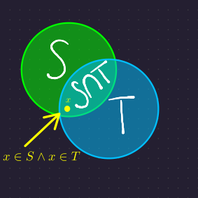
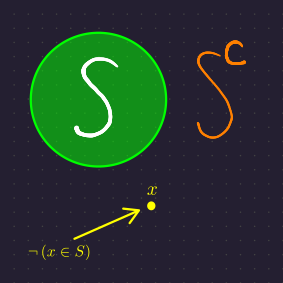
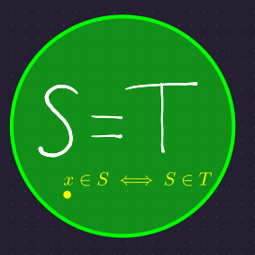

# Connecting Boolean and Set Operators

{{#include ../tex_common.md}}

The proofs we did with [boolean logic](../week_1/boolean_logic.md) can be applied to sets!

Say we have sets \\(S\\) and \\(T\\), and propositions \\(A\\) and \\(B\\). In general, we can map boolean operators to set operators:

<table>
<thead><th>Boolean Operator</th><th>Set Operation</th><th></th>
<tbody>
<tr><td>

\\(A \vee B\\)

</td><td>

\\(S \cup T\\)

</td><td>

</td></tr>
<tr><td>

\\(A \wedge B\\)

</td><td>

\\(S\cap T\\)

</td><td>

</td></tr>
<tr><td>

\\(\neg A\\)

</td><td>

\\(S^c\\)

</td><td>

</td></tr>
<tr><td>

\\(A \iff B\\)

</td><td>

\\(S = T\\)

</td><td>

</td></tr>
</tbody></table>

For example, say we have two sets \\(U\\) and \\(V\\).
\\[
\begin{aligned}
 S &= \left\\{ a\ :\ a \in U \wedge a \in V \right\\}\\\\
  &= \left\\{ a\ :\ a \in U \right\\} \cap \left\\{ a\ :\ a \in V\right\\}\\\\
  &= U \cap V
\end{aligned}
\\]

Similarly,
\\[
\begin{aligned}
       & S = T\\\\
   \iff& \forall a, \left(a \in S \iff a \in T\right)
\end{aligned}
\\]

Notice that by applying the boolean operators to elements in each set, we get the corresponding set operation!

<!-- ## Let's prove something! -->

