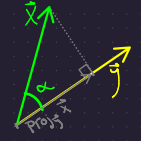

# Inner Products and Projection

{{#include ../tex_common.md}}

## `Cosine` and the inner product
\\[
\iprod{x, y} = ||x||\cdot ||y|| \cos (\alpha)
\\]

Where \\(x, y \in \mathbb{R}^n\\) and \\(\alpha\\) is the angle between the two vectors.

This comes from the law of cosines.

`TODO`: First, derive the law of cosines, then re-arrange.

## Projecting one vector onto another.

As above, let \\(x, y \in \mathbb{R}^n\\).

The projection of \\(x\\) onto \\(y\\) is denoted \\(\proj{y}{x}\\) and is a vector. Here, let's call it \\(p\\).

From the diagram above, we can see that \\(||p|| = ||x|| \cdot \cos(\alpha)\\). As such, \\(p = ||x|| \cdot \cos(\alpha) \cdot \frac{y}{||y||}\\).

Why does dividing by a vector's length normalize it?

\\(\frac{y}{||y||}\\) is a vector of unit length in the direction of \\(y\\). It's often denoted \\(\hat{y}\\) and is the "normalized" version of \\(y\\).

We can see that \\(\hat{y}\\) has unit length by calculating it (...assuming \\(\norm{y} > 0\\) so that \\(y\\) has direction):
\\[
\begin{aligned}
    \norm{\hat{y}} &= \sqrt{\norm{\hat{y}}^2} \\\\
    &= \sqrt{\norm{\frac{y}{\norm{y}}}}\\\\
    &= \sqrt{\frac{\norm{y}}{\norm{y}}} && \texttt{...because $||y||$ is a scalar}\\\\
    &= 1&&\square
\end{aligned}
\\]

We therefore have,
\\[
\begin{aligned}
 \proj{y}{x} &= \frac{\norm{x} \cdot \norm{y} \cdot \cos(\alpha) \cdot y}{\norm{y}^2}\\\\
 &= \frac{\iprod{x, y} \cdot y}{\norm{y}^2}\\\\
 &= \frac{\iprod{x, y}}{\norm{y}} \cdot \frac{y}{\norm{y}}
\end{aligned}
\\]

Of course, \\(\frac{y}{\norm{y}} = \hat{y}\\), which has length 1. We therefore get a _very_ simple expression for the length of the projected vector:
\\[
 \norm{\proj{y}{x}} = \frac{\iprod{x, y}}{\norm{y}}
\\]

## Interesting Special Case

Let \\(y = (1, 1, 1, ..., 1) \in \mathbb{R}^n\\). We then have,
\\[
\begin{aligned}
 \abs{\iprod{x, y}} &= \abs{\sum_{i = 1}^n x_i y_i} && \texttt{... by the definition of the inner product.}\\\\
 &= \abs{\sum_{i = 1}^n x_i} && \texttt{... because each $y_i = 1$}\\\\
 &\leq \norm{x} \norm{y} && \texttt{... by the Cauchy-Schwarz Theorem}\\\\
 &= \left(\sum_{i = 1}^{n} x_i^2\right)^{1/2} \left(\sqrt{n}\right)
\end{aligned}
\\]

We therefore have that,
\\[
 \abs{\sum_{i = 1}^n x_i} \leq \left(\sum_{i = 1}^{n} x_i^2\right)^{1/2} \left(\sqrt{n}\right)
\\]

for **any** \\(x \in \mathbb{R}^n\\). 😃
