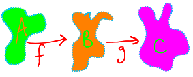

# Limit Proofs

{{#include ../tex_common.md}}

**Proposition:** \\(f: \R^2\to \R\\), \\(f(v) = v_1 + v_2\\) is continuous.

Let's say \\(\delta = \frac{\epsilon}{100}\\) (we can choose any \\(\delta\\) as long as it works!).

From the definition of continuity,
\\[
 \forall v_0 \in \R^2,\enspace \forall v \in \R^2,\enspace \forall \epsilon > 0,\enspace \exists \delta > 0.\enspace \left(\norm{v - v_0} < \delta\right) \to \left(\norm{f(v) - f(v_0)} < \epsilon\right)
\\]

We want to find \\(x, y, w, z \in \R\\) that satisfy,
\\[
 \norm{\begin{pmatrix}x\\\\y\end{pmatrix} + \begin{pmatrix}w\\\\z\end{pmatrix}} < \delta = \frac{\epsilon}{100}
\\]

...and for all of these...
\\[
 .
\\]

## Continuity of a Function Over ℝⁿ

**Theorem:** If \\(f: D \to \R^n\\), then \\(f\\) is continuous iff its components are continuous.

**↑ Its proof might be a homework problem. Proof omitted!**

## Continuity and Composition

Say we have functions \\(f : A \to B\\) and \\(g : B \to C\\) and \\(f\\) is continuous over \\(A\\) and \\(g\\) is continuous over \\(B\\).

`TODO`

## Continuity and Addition

`TODO`

## Continuity and Products

`TODO`
